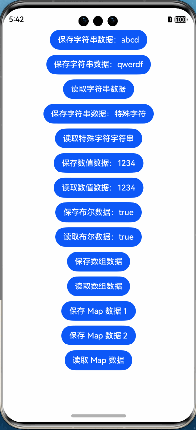

# PreferencesManager

## 基本介绍
PreferencesManager 是基于系统 Preferences 封装的，通过用户首选项实现数据持久化的工具类库。

其简化了创建 `preferences.Preferences` 的过程，使用全局 `ApplicationContext`，可以不用到处传 Context 了；

同时其封装的方法，大多基于系统 **Sync** 同步方法，方便外部调用；

另外本库还支持了 **Map<string, Object>** 相关类型的存取和监听，方便使用；

最后本库也露出了 `preferences.Preferences` 实例，可供集成方调用系统的相关方法。



## 相关特性
* 适配 HarmonyOS，API 12+
* 简化创建过程，逻辑简单，使用方便
* 支持特殊字符串的编解码
* 支持 Map<string, Object> 数据类型存取和监听
* 存储变更时会及时 flush 写入，持久化存储
* 支持多种数据类型 get 方法调用 
* ...


## 主要方法

| 方法类型 | 方法名             | 作用                                           |
| :------- | :----------------- | :--------------------------------------------- |
| 静态方法 | setDefManager      | 设置默认管理类的 Preferences 名称 和 Context   |
| 静态方法 | defManager         | 默认创建的 PreferencesManager 管理类           |
| 静态方法 | hasManager         | 自定义的 PreferencesManager 是否存在           |
| 静态方法 | removeManager      | 移除自定义的 PreferencesManager                |
| 实例方法 | preferences        | 获取系统 `preferences.Preferences` 实例        |
| 实例方法 | clear              | 清除所有记录的数据                             |
| 实例方法 | has                | 对应 key 的记录是否存在                        |
| 实例方法 | delete             | 删除对应 key 的记录（数据）                    |
| 实例方法 | save               | 保存对应 key 的记录（数据）                    |
| 实例方法 | saveMapValue       | 保存对应 key 的 **Map** 类型的数据             |
| 实例方法 | get                | 获取对应 key 的记录（数据）                    |
| 实例方法 | getAll             | 获取全部记录的值                               |
| 实例方法 | getStringValue     | 获取对应 key 的**字符串**值                    |
| 实例方法 | getNumberValue     | 获取对应 key 的**数值**值                      |
| 实例方法 | getBoolValue       | 获取对应 key 的**布尔**值                      |
| 实例方法 | getArrayValue      | 获取对应 key 的**数组**值                      |
| 实例方法 | getUint8ArrayValue | 获取对应 key 的**Uint8Array**值                |
| 实例方法 | getMapValue        | 获取对应 key 的**Map**类型的值                 |
| 实例方法 | onChange           | 订阅所有 key 对应的数据变更                    |
| 实例方法 | onDataChange       | 订阅指定 key 数组，对应的通用数据变更          |
| 实例方法 | onMapDataChange    | 订阅指定 key 数组，对应的 **Map** 数据变更     |
| 实例方法 | offChange          | 取消订阅所有 key 对应的数据变更                |
| 实例方法 | offDataChange      | 取消订阅指定 key 数组，对应的数据变更          |
| 实例方法 | offMapChange       | 取消订阅指定 key 数组，对应的 **Map** 数据变更 |

## 安装

ohpm 安装：
```
ohpm install @yue/preferences_manager
```

或者 `oh-package.json5` 中有本库的依赖。
```
"dependencies": {
  "@yue/preferences_manager": "^1.0.0"
}
```

## 使用示例：
### 保存
```
// 通过 key 保存 字符串 数据
PreferencesManager.defManager.save("stringKey", "abcd");

// 通过 key 保存 特殊字符 字符串
PreferencesManager.defManager.save("stringKey2", "~！@#￥%……&*（）——+？", true);

// 通过 key 保存 数值 数据
PreferencesManager.defManager.save("numberKey", 1234);

// 通过 key 保存 布尔 数据
PreferencesManager.defManager.save("boolKey", true);

// 通过 key 保存 Array<string | number | boolean> 类型的数据
PreferencesManager.defManager.save("arrayKey", ['abc', '666', true, 123]);

// 通过 key 保存 Map<string, Object> 类型的数据
let map = new Map<string, Object>([
  ['mapKey1', 'mapValue'],
  ['mapKey2', 1234],
  ['mapKey3', false],
]);
PreferencesManager.defManager.saveMapValue("mapKey", map);
```

### 获取

```
// get 获取方法中均支持可选参数 defValue，若无法取到，则会返回默认值

// 通过 key 读取 字符串 数据
let value = PreferencesManager.defManager.getStringValue("stringKey");

// 通过 key 读取 特殊字符 字符串
let value = PreferencesManager.defManager.getStringValue("stringKey2", "取不到时设定的默认值", true);

// 通过 key 读取 数值 数据
let value = PreferencesManager.defManager.getNumberValue("numberKey");

// 通过 key 读取 布尔 数据
let value = PreferencesManager.defManager.getBoolValue("boolKey");

// 通过 key 读取 Array<string | number | boolean> 类型的数据
let value = PreferencesManager.defManager.getArrayValue("arrayKey");

// 通过 key 读取 Map<string, Object> 类型的数据
let value = PreferencesManager.defManager.getMapValue("mapKey");
```

### 删除&清空
```
// 删除对应 key 的数据
PreferencesManager.defManager.delete("stringKey");

// 清除所有记录的数据
PreferencesManager.defManager.clear();
```

### 监听与移除
```
// 监听所有数据的变更
PreferencesManager.defManager.onChange((changedKey: string) => {
  this._toast('监听所有数据变更\n变更数据的 key 为：' + changedKey);
});

// 监听指定 key 的数据变更
PreferencesManager.defManager.onDataChange(['stringKey'], (data: Record<string, preferences.ValueType>) => {
  this._toast('监听到指定 key 的数据变更：\n' + Utils.jsonStringify(data));
});

// 监听指定 key 的 Map<string, Object> 数据变更
PreferencesManager.defManager.onMapDataChange(['mapKey'], (data: Map<string, Map<string, Object>>) => {
  this._toast('监听到指定 key 的数据变更(Map)：\n' + Utils.jsonStringify(data));
});

// 移除 所有数据变更 的监听
PreferencesManager.defManager.offChange();
// 移除 指定 key 数据变更 的监听
PreferencesManager.defManager.offDataChange(['stringKey']);
// 移除 指定 Map<string, Object> 数据变更 的监听
PreferencesManager.defManager.offMapChange(['mapKey']);
```

### 自定义 Preferences 的 名称 和 Context
```
// 自定义名称
let customManager = new PreferencesManager({ preferencesName: "自定义的名称" });

// 自定义名称 和 Context
let customManager = new PreferencesManager({ preferencesContext: getContext(this), preferencesName: "自定义的名称" });

// 若要自定义 Manager ，则读取写入监听等操作均需使用自定义 Manager 的实例，例如：
customManager.save("stringKey", "abcd");

let value = customManager.getStringValue("stringKey");

customManager.onChange((changedKey: string) => {
});
```

### 调用系统 Preferences 相关方法
```
// Manager 实例 .preferences 即可获取系统 preferences
PreferencesManager.defManager.preferences?.put("key", "value", (error: BusinessError) => {
});
```

## 最后
本库基于 [Apache License 2.0](https://github.com/1ilI/PreferencesManager_harmony/blob/master/preferences_manager/LICENSE) 协议，如果你发现了任何问题或者有改进的建议，欢迎创建 [issue](https://github.com/1ilI/PreferencesManager_harmony/issues) 或者提交 [PR](https://github.com/1ilI/PreferencesManager_harmony/pulls)。


